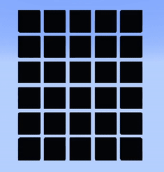

# mcwordle - Wordle in Minecraft!

This project can be built with Gradle. The plugin JAR will be found in the `build/libs` directory. For a prebuilt JAR, see the [releases page](https://github.com/WHEOfficial/mcwordle/releases).
